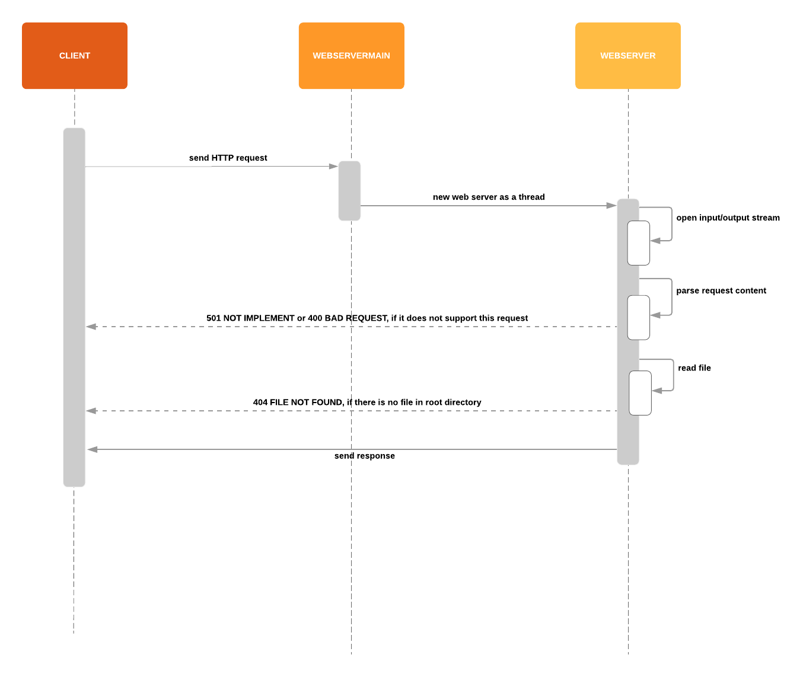

# Simple HTTP Web Server in Java

A simple HTTP Server implemented in Java based on W3C specifications (http://www.w3.org/Protocols/)

## Features
 * Implement with Java I/O streams
 * Support GET/HEAD requests
 * Support POST/PUT with query string and request payload
 * Respond to binary data request (ex. images)

It can also
 * Logging 
 * Multithreading

It is an part of [CS5011](https://info.cs.st-andrews.ac.uk/student-handbook/modules/CS5001.html) at University of St. Andrews.


## Running

To start the web server, clone and run the following command:

```sh
java WebServerMain <document_root> <port> <option>
```

`<document_root>` directory that contain files for your website

`<port>` port number

`<option>` there is only one option `-v` to enable logging by piping all System.in and System.out into a log file -- `access_log.txt` and `error_log.txt` respectively.

### For example

```sh
java WebServerMain ./www 8000 -v
```

To terminate the server, just press `Ctrl+C` on the command line.


## How it work
There are only 2 classes; `WebServerMain` and `WebServer`

`WebServerMain` is used to handle arguments from command line and establish a server socket. A new thread will be initiated when there is a new connection. 

`WebServer` is initialed as a child thread implementing as `Runnable`object . It starts with initializing input and output stream. It used 2 types of output streams; a `PrintWriter` to send binary data (for requested data) and `BufferedOutputStream` to send character data (for response headers). All request data will be parsed by `StringTokenizer` and it, then, opens the requested file by `FileInputStream` which is a binary stream so it works with both plain text and image file. Finally, it will send all requested data back in HTTP format.

Log files are created by piping data from System.out and System.err to a `FileOutputStream`. The work flow could be clearly explained by the below sequence diagram.




### Todos
 * Do MORE Tests
    * `src/www/index.html`.
    * `src/www/sendrequest.html` shows how it works with GET/POST AJAX requests.
 * Use `ThreadPoolExecutor` to handle queue and schedule requests
 * Implement request timeout handler
 * Handle malformed HTTP request

## Author
[Pakawat Nakwijit](http://curve.in.th); An ordinary programmer who would like to share and challange himself. It is a part of my 2018 tasks to open source every projects in my old treasure chest with some good documentation. 

## License
This project is licensed under the terms of the MIT license.


